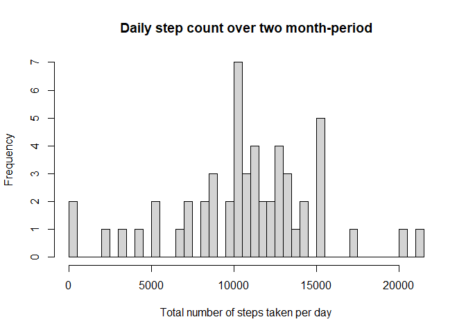
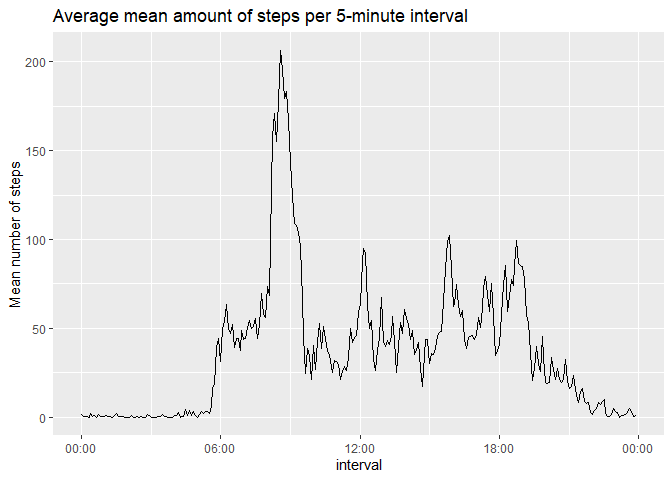
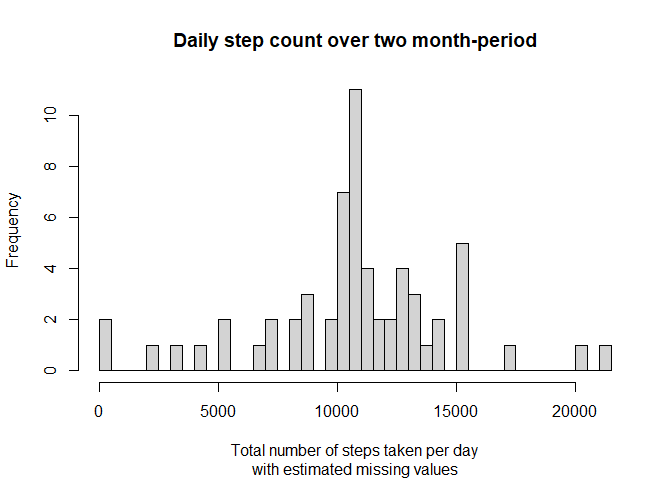
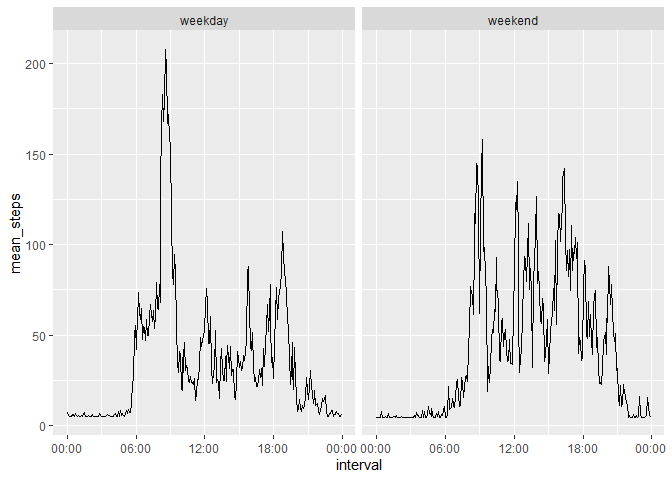

PA1\_template.Rmd
================
Max Aantjes
09/07/2020

## Loading and preprocessing data

The dataset is available through an url and stored in a zip folder. In
order to load the data into R, the code:

1.  Downloads the folder from the url and stores it into a temporary
    directory;  
2.  Unzips the file to check for the name of the csv file and then
    unzips the file to allow for extraction;  
3.  Reads the csv file into object *df0* and unlinks the temporary
    directory.

<!-- end list -->

``` r
# Step 1
url <- "https://d396qusza40orc.cloudfront.net/repdata%2Fdata%2Factivity.zip"
td = tempdir()
temp = tempfile(tmpdir=td, fileext=".zip")
download.file(url, temp)

# Step 2
unzip(temp, list = TRUE)
```

    ##           Name Length                Date
    ## 1 activity.csv 350829 2014-02-11 10:08:00

``` r
unzip(temp, overwrite = TRUE, exdir = td)

# Step 3
df0 <- read.csv(file.path(td, "activity.csv"))
unlink(td)
```

## What is mean total number of steps taken per day?

To answer this question, we first load a useful R package (tidyverse).

``` r
# Step 1
library(tidyverse)
```

We then remove missing values, group by date, calculate the mean amount
of steps and generate a simple histogram.

``` r
# Step 2
df1 <- df0 %>%
        drop_na() 

df2 <- df1 %>%
        group_by(date) %>%
        summarise(steps_per_day = sum(steps))

## Step 3
hist(df2$steps_per_day, breaks = 50, 
     main = "Daily step count over two month-period", 
     xlab = "Total number of steps taken per day")
```

<!-- -->

Finally, we calculate the mean (10766.19) and median (10765) through
their respective base R functions.

``` r
## Step 4
mean(df2$steps_per_day)
```

    ## [1] 10766.19

``` r
median(df2$steps_per_day)
```

    ## [1] 10765

## What is the average daily activity pattern?

In order to answer this question, we first load some useful packages.

``` r
# Step 1
library(stringr)
library(lubridate)
```

First, we summarise the mean of steps for every intervall across all
days into a new dataframe (df2).

``` r
df2 <- df1 %>%
        group_by(interval) %>%
        summarise(mean_steps = mean(steps))
```

We then create a new dataframe (df3) in which we convert the integer
intervall values into an hour/minute variable.

``` r
df3 <- df2 %>%
        
        mutate(interval = as.character(interval)) %>%
        
        mutate(interval = ifelse(nchar(interval) == 1, 
                                 paste0("000", interval), interval)) %>%
        
        mutate(interval = ifelse(nchar(interval) == 2, 
                                 paste0("00", interval), interval)) %>%
        
        mutate(interval = ifelse(nchar(interval) == 3, 
                                 paste0("0", interval), interval)) %>%
        
        mutate(interval = paste0(
                str_extract(interval, "^[0-9][0-9]"), ":", 
                str_extract(interval, "[0-9][0-9]$")))
        
df4 <- df3 %>%
        
        mutate(interval = as.POSIXct(interval, format = "%H:%M"))
```

Next, we create a plot with interval on the x axis and mean\_steps on
the y axis.

``` r
ggplot(df4, aes(x=interval, y=mean_steps)) + geom_line() + scale_x_datetime(date_label = "%H:%M") + 
        labs(title = "Average mean amount of steps per 5-minute interval", y = "Mean number of steps")
```

<!-- -->

Finally, we calculate the 5-minute interval with the maximum number of
steps by applying the max function on df2.

``` r
df3$interval[df3$mean_steps == max(df3$mean_steps)]
```

    ## [1] "08:35"

## Imputing missing values

To check the impact of missing values on our analysis so far, we
calculate the number of missing values in the data set (2304).

``` r
sum(is.na(df0$steps))
```

    ## [1] 2304

Now we create a new dataframe (df4) in which we replace the missing
values with the *mean* for that 5-minute interval across all days and
transform the date variable to class “date”.

``` r
df4 <- df0 %>%
        mutate(steps = ifelse(is.na(steps), 
                              mean(df0$steps[df0$interval == interval],
                                   na.rm = TRUE), 
                              steps)) %>%
        mutate(date = as.Date(date, format = "%Y-%m-%d"))
```

Finally, we create a new dataframe (df5) in which we calculate the
number of steps for each day. From this, we can generate a histogram
with the total number of steps taken each day.

``` r
df5 <- df4 %>%
        group_by(date) %>%
        summarise(tot_steps = sum(steps))
        
        
hist(df5$tot_steps, breaks = nrow(df5), 
     main = "Daily step count over two month-period", 
     sub = "with estimated missing values",
     xlab = "Total number of steps taken per day")
```

<!-- -->

## Are there differences in activity patterns between weekdays and weekends?

For this question, we create a new factor variable in the data set which
indicates whether a given date is a weekday or a weekend day.

``` r
df5 <- df4 %>%
        mutate(week.section = factor(ifelse(
                weekdays(date) == "Saturday" |
                        weekdays(date) == "Sunday",
                "weekend", "weekday")))
```

Now we simply use the same method as before to transform the interval
integer variables into hour variables.

``` r
df6 <- df5 %>%
          mutate(interval = as.character(interval)) %>%
        
        mutate(interval = ifelse(nchar(interval) == 1, 
                                 paste0("000", interval), interval)) %>%
        
        mutate(interval = ifelse(nchar(interval) == 2, 
                                 paste0("00", interval), interval)) %>%
        
        mutate(interval = ifelse(nchar(interval) == 3, 
                                 paste0("0", interval), interval)) %>%
        
        mutate(interval = paste0(
                str_extract(interval, "^[0-9][0-9]"), ":", 
                str_extract(interval, "[0-9][0-9]$"))) %>%
        
        mutate(interval = as.POSIXct(interval, format = "%H:%M"))
```

Next, we calculate the mean steps for every single 5-minute interval
across weekdays and weekends.

``` r
df7 <- df6 %>%
        group_by(week.section, interval) %>%
        summarise(mean_steps = mean(steps))
```

Finally, we plot the panel plot comparing the average number of steps
taken per 5-minute interval across weekdays and weekends.

``` r
ggplot(df7, aes(x=interval, y=mean_steps)) + facet_grid(~week.section) + geom_line() + scale_x_datetime(date_label = "%H:%M")
```

<!-- -->
